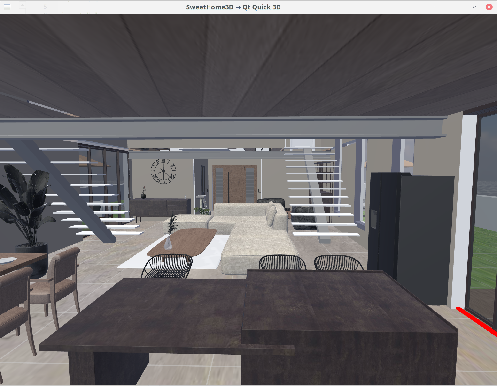

QML Viewer for SweetHome3D models
=================================

This hobby project is a simple viewer for SweetHome3D models (.sh3d files).
It is mainly written in QML, and heavily uses the new QtQuick3D API.

It is currently only tested on Qt 6.11.

How to use it
-------------

Build the CMake project, and run it with:

```sh3d-viewer-qml path_of_model.sh3d```

Navigation can be done both using mouse and keyboard (WASD controller).

Known issues
------------

* Rarely, some DAE models are not processed correctly by the AssImp importer, i.e. the geometry can be wrong or missing.
* Texture are not always properly scaled
* Light sources are not active by default, because it can lead to very heavy computing load, and QtQuick3D is limited by the hardware to a low number of light sources
* Some doors/widows might fail to completely cut through the wall

And probably plenty more!

Screenshots
-----------

Keep in mind that this is realtime rendering, not a raytracing rendering.
Also, lights aren't rendered in this example, it is just an ambiant light.

Here is one example rendering:



